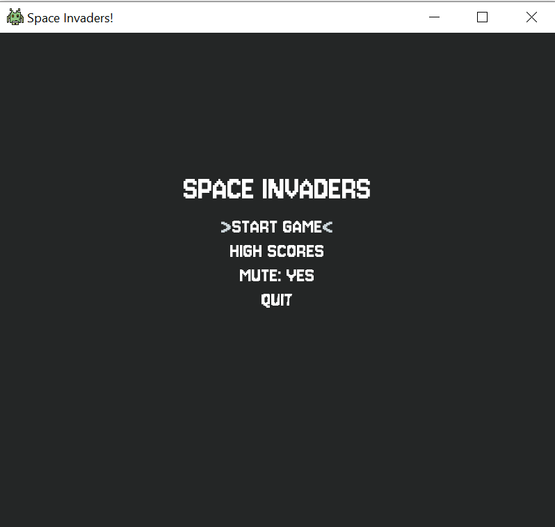
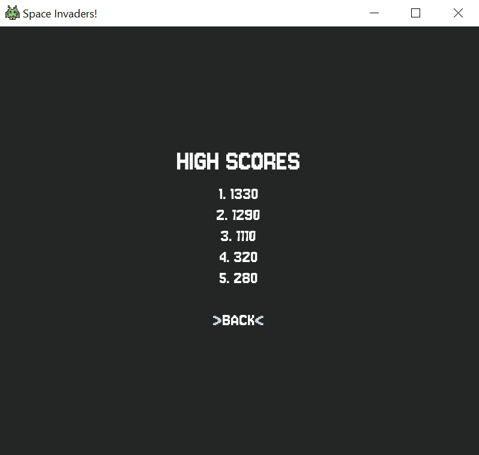
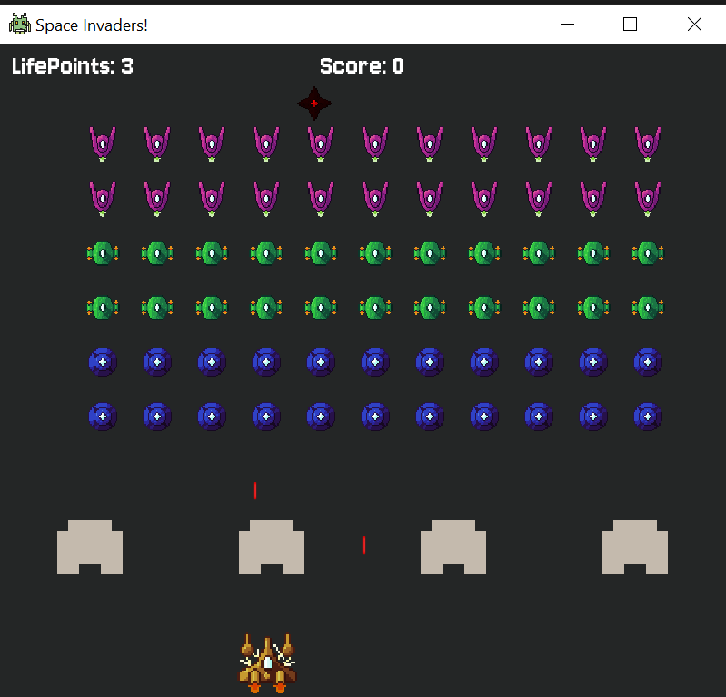
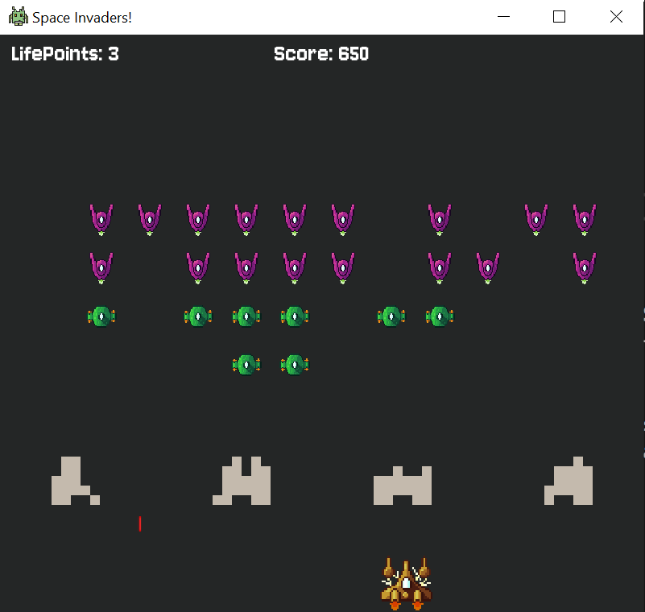
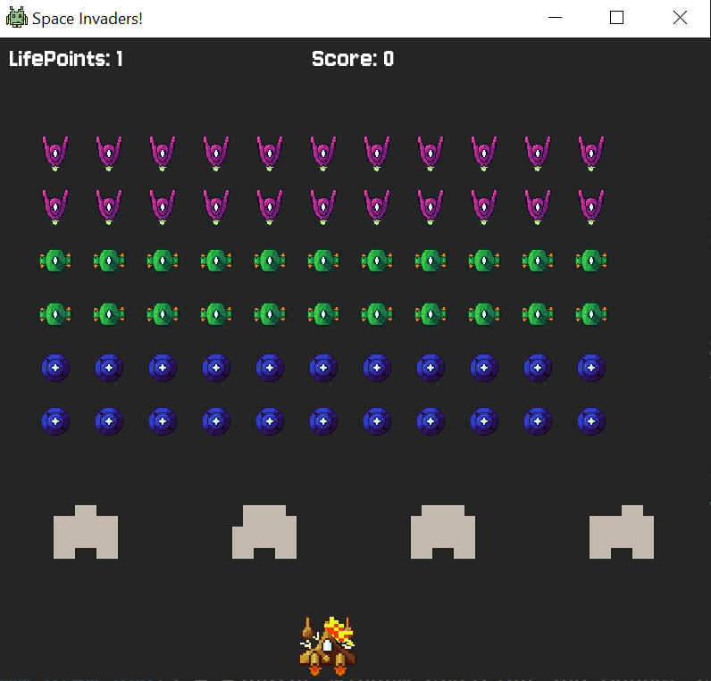
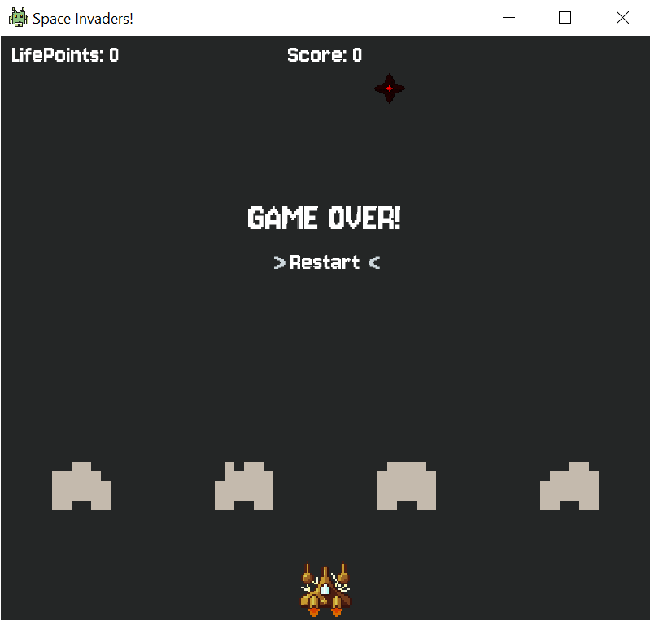

# Space Invaders

Remake of the 80s classic game **SPACE INVADERS** using **OpenGL** and **C++**.


# Table of contents
- [Some screenshots](#shots)
- [Introduction](#introduction)
- [Dependencies](#dependencies)
- [Controls](#controls)
- [Game Concepts](#game-concepts)
- [Highlights](#highlights)
- [pkEngine](#pkengine)
- [Download](#download)
- [Future Improvements](#future-improvements)

# Shots
#### Main menu


#### Highscores menu


#### Gameplay



#### Player Hit


#### GameOver


# Introduction

This project is a modern remake of the iconic 80s game **SPACE INVADERS**, 
developed as a hands-on learning experience to explore **OpenGL** and fundamentals 
game development techniques and concepts. 

I have explored some optimization techniques because I didn’t want to stray from the original game, 
which had to cope with the memory and processing limitations of the Atari 2600.

**Limitation is the first step to sparking creativity and innovation**, I believe.

## Dependencies

- [GLFW](https://www.glfw.org/) - Handles window creation and OpenGL context management
- [GLM](https://github.com/g-truc/glm) - Provides vector and matrix operations for 3D math
- [STB](https://github.com/nothings/stb) - Used for loading and decoding image files
- [FreeType](https://freetype.org/) - Enables rendering of TrueType fonts
- [FMOD](https://www.fmod.com/) - For sound effects and music

# Controls

Keyboard:

- **Up/Down**: menu navigation
- **Enter**: select menu option
- **Left/Right**: move ship
- **Space**: shoot laser
- **Esc**: return to menu

Gamepad:

- **Dpad up/down**: menu navigation
- **Cross/A**: select menu option
- **Dpad left/right**: move ship
- **Square/X**: shoot laser
- **Start**: back to menu

# Game concepts

- **Loop**: 
	- Shoot lasers to destroy invading aliens;
	- Dodge enemy projectiles;
	- Earn points by destroying aliens;
	- Sruvive as long as possible;
- **Bunkers**: 
	- Take cover under a bunker for protection;
	- Composed of individual bricks;
	- Both player and enemy lasers can destroy bricks;
- **Enemies**: 
	- Randomly fire at the player every 1 to 3 seconds; 
	- Up to 3 aliens can shoot simultaneously; 
	- Their speed increases as more aliens are eliminated;
- **Score**: 
	- The higher an alien is positioned on the screen, the more points it grants;
	- Upon Game Over or returning to the menu, the current score is saved in the high score board if eligible; 
- **Bonus**: 
	- A secret alien spawns randomly every 5 to 10 seconds; 
	- It grants the highest possible score (100 points); 
	- It moves significantly faster than regular enemies;
- **Game Over**: 
	- Players have 3 life points;
	- Losing a life occurs when hit by an enemy projectile;
	- After being hit, the game pauses briefly to clear the screen before respawning the player; 
	- Upon losing all 3 life points, the Game Over screen appears, offering options to restart or return to the menu;

# Highlights

## Collision handling

With over 66 aliens, a player, 4 bunkers (composed of individual bricks), 
and multiple projectiles on screen at once, collision detection can quickly become quite expensive. 
To optimize this, I implemented a QuadTree structure to manage collisions efficiently.

**Key Features**:
- **Loose**: Objects near quadrant edges are correctly detected;
- **Optimized Retrieval**: Queries the QuadTree with a position to retrieve nearby objects to minimize unnecessary collision checks.
- **Frame-by-Frame Updates**: The QuadTree is recalculated each frame, dynamically repositioning all collision objects.
- **Pool**: A pool of Quads is pre-allocated at startup to avoid runtime memory allocation;
- **5 entities per node**: When exceeded, the Quad is split into four smaller Quads;
- **4 levels of depth**: Ensures fine-grained collision detection;

Every frame I query the QuadTree for every projectile and do a collision check
only with relevant objects in the vicinity.
Collision detection has been done using the AABB technique.

```cpp
void QuadTree::Divide()
{
	// BoundingBox calculations...

	const int ChildrenLevel = CurrentLevel + 1;

	TopLeft = QuadPool::Get().GetQuadTree(); // Get from pool, no allocation
	TopLeft->Reset(TopLeftOrigin, HalfWidth, HalfHeight, ChildrenLevel);

	TopRight = QuadPool::Get().GetQuadTree(); // Get from pool, no allocation
	TopRight->Reset(TopRightOrigin, HalfWidth, HalfHeight, ChildrenLevel);

	BottomLeft = QuadPool::Get().GetQuadTree(); // Get from pool, no allocation
	BottomLeft->Reset(BottomLeftOrigin, HalfWidth, HalfHeight, ChildrenLevel);

	BottomRight = QuadPool::Get().GetQuadTree(); // Get from pool, no allocation
	BottomRight->Reset(BottomRightOrigin, HalfWidth, HalfHeight, ChildrenLevel);

	for (const QuadEntity& Entity : Entities)
	{
		InsertInChildren(Entity); // Insert in quad if needed
	}

	Entities.clear(); // Entities get distributed in inner children
	bDivided = true;
}

// Positions are checked against loose boundaries
// Loose boundaries are calculated based on QUAD_LOOSE_PERCENTAGE, which now is 15%
bool QuadBox::LooseContains(const glm::vec3& InLocation) const
{
	const float Right = LooseOrigin.x + LooseWidth;
	const float Bottom = LooseOrigin.y + LooseHeight;
	return (InLocation.x >= LooseOrigin.x && InLocation.x <= Right) &&
		(InLocation.y >= LooseOrigin.y && InLocation.y <= Bottom);
}
```

## Components Based Architecture

This new version of the engine shifts from an inheritance-heavy approach to an **Entity-Component System** (ECS). 
Each actor in the scene can have multiple components, making it easy to extend functionality.

### Example: Team Component
Instead of using inheritance or interfaces to define team affiliation, 
I introduced a TeamComponent that can be attached to any actor. 
In this case it has been added to the ```Alien```, ```Player```, ```Bunker``` and ```Projectile``` class.

```cpp
enum class Team : std::uint8_t
{
	None,
	Human,
	Alien,
	Brick
};

class TeamComponent : public Component
{
public:
	typedef std::shared_ptr<TeamComponent> SharedPtr;

	TeamComponent(const ActorWeakPtr& InOwner);

	void SetTeam(Team InTeam);
	Team GetTeam() const;

private:
	Team CurrentTeam;
};

void Projectile::OnHit(const Actor::SharedPtr& HitActor, const CollisionResult& Result)
{
	const TeamComponentPtr HitTeamComponent = HitActor->GetComponent<TeamComponent>();
	// Skip same team
	if (!HitTeamComponent || GetTeam() == HitTeamComponent->GetTeam())
	{
		return;
	}

	// Deal damage to HitActor
}
```

## Object Pooling
Since the game must handle numerous dynamically spawned objects (projectiles, aliens and QuadTree nodes), 
I implemented object pooling to reduce memory allocations and improve performance.

- **Projectile**: 
	- Both the player and aliens use a projectile pool with a configurable size;
	- Instead of allocating a new projectile, existing ones are reused, getting from the assigned pool;
- **Invaders**: 
	- Aliens are spawned once at startup and simply reset when needed, rather than being reallocated.;
	- On Alien hit, it becomes invisible;
	- On Game over this class just recalculate the initial positions and make all Aliens visible again;
- You can check **QuadPool** in [Collision handling](#collision-handling)

```cpp
Projectile::SharedPtr ProjectilePool::Create(const glm::vec3& InLocation, Team InTeam)
{
	Projectile::SharedPtr OutProjectile = Pool[NextIndex];
	// Set necessary properties...

	NextIndex = (NextIndex + 1) % PoolSize;
	return OutProjectile;
}

void Ship::Shoot()
{
	glm::vec3 SpawnLocation(GetLocation());
	SpawnLocation.y -= (GetSize().y / 2);

	Projectile::SharedPtr NewProjectile = CurrentProjectilePool->Create(SpawnLocation, TeamPtr->GetTeam());
	// Set necessary event delegates...
	CurrentScene->Add(NewProjectile);

	// Play audio and cooldown shooting
}
```

## Events
Maintaining the engine agnostic to game logic has been a challenge. 
Events have been used to bind a callback on some crucial gameplay events. 
I used the ```std::function<>``` class from **STL** to bind and run a callback.

```cpp
class AlienGroup : public Actor
{
public:
	typedef std::function<void()> OnReachedPlayerDelegate;
	typedef std::function<void()> OnDefeatDelegate;

	void AddOnReachedPlayerDelegate(const OnReachedPlayerDelegate& InFunction);
	void AddOnDefeatDelegate(const OnDefeatDelegate& InFunction);
private:
	void NotifyReachedPlayer() const;
	void NotifyDefeat() const;

	std::vector<OnReachedPlayerDelegate> OnReachedPlayerFunctions;
	std::vector<OnDefeatDelegate> OnDefeatFunctions;
};

void AlienGroup::NotifyReachedPlayer() const
{
	for (const OnReachedPlayerDelegate& Function : OnReachedPlayerFunctions)
	{
		Function();
	}
}

void Game::SpawnAliens()
{
	MainAlienGroup = std::make_shared<AlienGroup>();
	MainAlienGroup->AddOnReachedPlayerDelegate([this]() { OnInvadersReachedPlayer(); });
	MainAlienGroup->AddOnDefeatDelegate([this]() { OnInvadersDefeat(); });

	Add(MainAlienGroup);
}

void Game::OnInvadersReachedPlayer()
{
	OnGameOver(false);
}

void Game::OnInvadersDefeat()
{
	OnGameOver(true);
}
```

# pkEngine
pkEngine is a lightweight **2D game engine** developed alongside this project. 
While still in its early stages, it provides a robust framework for 2D game development, offering essential tools and utilities.

## Features

### Rendering

pkEngine includes classes for rendering 2D sprites, text and vfx efficiently:

- **Shader**: Manages **vertex** and **fragment** shaders, compiling and linking them into a shader program;
- **Texture**: Loads **image** files and creates OpenGL textures for rendering;
- **Font**: Loads TrueType fonts (TTF) and **renders text** as textures;
- **Emitter**: Renders textures as **particles**, supporting various **patterns** for dynamic effects;
- **EmitterPattern**: Define the behaviour of a particle
	* **LinearPattern**: Particles move in a linear direction, opposite to the attached actor;
	* **BouncePattern**: Simulates an explosion by spawning particles in multiple directions based on collision;
- **Renderer**: A manager class responsible for rendering everything on screen;

### Miscellaneous

pkEngine provides utility classes to simplify common tasks:

- **Window**: Handles the lifecycle of a **GLFW window** and provides utility functions for window handling;
- **AssetManager**: Loads and stores game **assets** (textures, fonts, sounds) to **avoid redundant** loading;
- **SoundEngine**: Integrates **FMOD** for audio playback, supporting WAV and other formats. Includes **jukebox** functions for volume and pitch control and sound looping; 
- **Settings Reader**: Reads **config** files and applies properties to game classes using a **Key=Value** format;
- **QuadTree**: Enables QuadTree **construction** and **querying** to partition **Actors** in the Scene space;

### Save system 
A new save system has been integrated in the engine to streamline (pretentious) the typical loading and saving workflow of a game.
The system is divided into two main components:
- **Handler**: object containing all properties that needs to be loaded and saved for the game;
	- Responsible for **reading** from the **FileHandler** and populate the necessary properties. 
	- Responsible for **writing** using the **FileHandler**.
- **Manager**: the singleton responsible of managing the lifecycle of an Handler;

```cpp
class SaveSystem
{
public:
	template<typename T>
	void TriggerLoad(const std::string& FilePath);
	void TriggerSave() const;

	bool IsValid() const;

	template<typename T>
	std::shared_ptr<T> GetSaveObject() const;
private:
	SaveSystem();

	template<typename T>
	void Load(const std::string& FilePath);
	void Save() const;
};

// Open the file using the binary option and pass the stream handler to the actual SaveHandler
template<typename T>
void SaveSystem::Load(const std::string& FilePath)
{
	static_assert(std::is_base_of<ISaveFile, T>::value);

	std::ifstream Reader;
	Reader.open(FilePath, std::ios::binary);
	CurrentSave = std::make_shared<T>();
	CurrentSave->Load(Reader);
	CurrentFilePath = FilePath;
}

// An example from Space Invaders
void GameSave::Load(std::ifstream& Reader)
{
	if (!Reader.good())
	{
		return;
	}

	// A SaveHandler is responsible of reading from file and populate the properties
	int TotalScores = 0;
	Reader.seekg(0, std::ios::beg);
	Reader.read(reinterpret_cast<char*>(&CurrentSave.bMuted), sizeof(CurrentSave.bMuted));
	Reader.read(reinterpret_cast<char*>(&TotalScores), sizeof(TotalScores));

	CurrentSave.Scores.clear();
	for (int i = 0; i < TotalScores; ++i)
	{
		if (!Reader.good()) { break; }

		int Score = 0;
		Reader.read(reinterpret_cast<char*>(&Score), sizeof(Score));
		CurrentSave.Scores.push_back(Score);
	}
}
```

### Input handling
The ```InputHandler``` class manages all inputs coming from the keyboard and the first connected GamePad.
It needs to be configured to detect Keys and Buttons to detect three types of event:
- **Press**
- **Hold**
- **Release**

```cpp
enum class InputType : std::uint8_t
{
	Press,
	Hold
};

enum class InputStatus : std::uint8_t
{
	None,
	Pressing,
	WaitingRelease
};

// An example from Spave Invaders
Game::Game()
{
	IHandler.HandlePad(GLFW_JOYSTICK_1);

	IHandler.HandleKey(GLFW_KEY_LEFT, InputType::Hold);
	IHandler.HandleKey(GLFW_KEY_RIGHT, InputType::Hold);
	IHandler.HandleKey(GLFW_KEY_SPACE, InputType::Hold);

	IHandler.HandleKey(GLFW_KEY_UP, InputType::Press);
	IHandler.HandleKey(GLFW_KEY_DOWN, InputType::Press);
	IHandler.HandleKey(GLFW_KEY_ENTER, InputType::Press);

	IHandler.HandlePadKey(GLFW_GAMEPAD_BUTTON_START, InputType::Press);
	IHandler.HandlePadKey(GLFW_GAMEPAD_BUTTON_DPAD_UP, InputType::Press);
	IHandler.HandlePadKey(GLFW_GAMEPAD_BUTTON_DPAD_DOWN, InputType::Press);
	IHandler.HandlePadKey(GLFW_GAMEPAD_BUTTON_CROSS, InputType::Press);

	IHandler.HandlePadKey(GLFW_GAMEPAD_BUTTON_DPAD_LEFT, InputType::Hold);
	IHandler.HandlePadKey(GLFW_GAMEPAD_BUTTON_DPAD_RIGHT, InputType::Hold);
	IHandler.HandlePadKey(GLFW_GAMEPAD_BUTTON_SQUARE, InputType::Hold);
}

void Ship::Input(const InputHandler& Handler, const float Delta)
{
	// Handle player's ship movement
	glm::vec3 Direction(0.f, 0.f, 0.f);
	if (Handler.IsPressed(GLFW_KEY_LEFT) || Handler.IsPadPressed(GLFW_GAMEPAD_BUTTON_DPAD_LEFT))
	{
		Direction.x = -1.f;
	}
	else if (Handler.IsPressed(GLFW_KEY_RIGHT) || Handler.IsPadPressed(GLFW_GAMEPAD_BUTTON_DPAD_RIGHT))
	{
		Direction.x = 1.f;
	}

	SetVelocity(Direction * Speed);
}
```
### Gameplay

pkEngine includes classes to handle gameplay mechanics:

- **Actor**: The base class for all **game objects**. It represents a 2D movable sprite with a transform, texture, and collision detection using **AABB**;
- **Component**: Objects attachable to Actors to implement custom logic. They can be queried from Actor to retrieve a specific Component.
- **Scene**: World object containing a list of all Actors, responsible for **loading assets**, delegating **rendering**, handling **input** and **updating** every object. Should be extended.

# Download

You can download a working build of the game [here](https://github.com/zSelimReborn/SpaceInvaders/releases/tag/v1.0).

Since there is no cooked content I encourage you to change the configuration files to make the game
more dynamic :)

# Future improvements

- **Advanced Shaders**: Implement more complex shaders for **post-processing** effects;
- **Advanced Rendering**: Support rendering of more **complex shapes**;
- **Improve Collisions**: Add additional collisions detection techniques, such as **circle-to-AABB** and **capsule-to-AABB**;
- **Multiple Gamepad support**: Extend the InputHandler to detect button presses for multiple gamepads;

# Credits

- Assets from [OpenGameArt](https://opengameart.org/)
